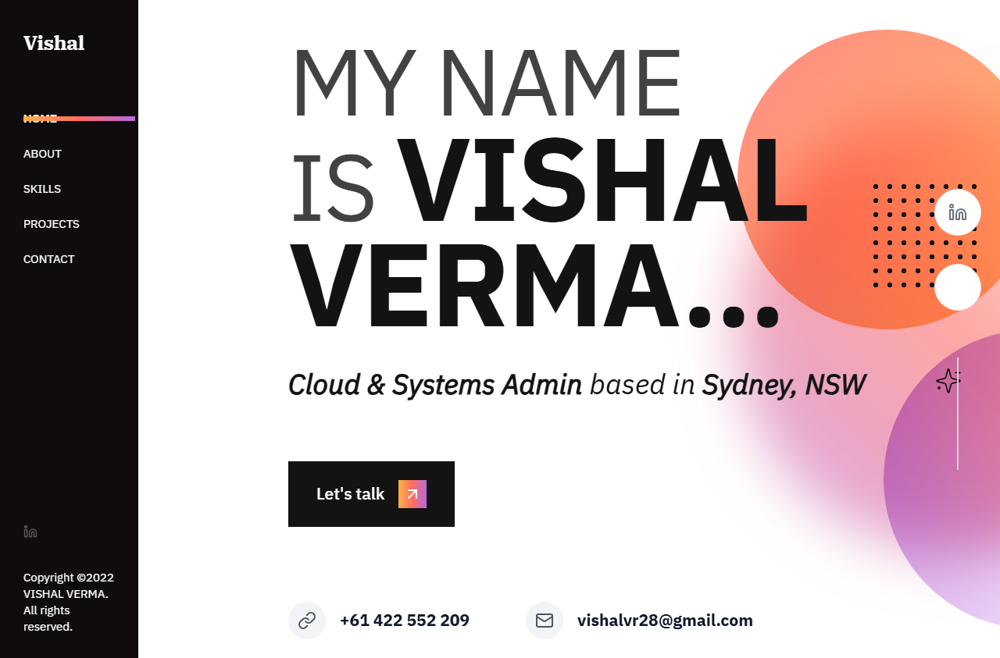
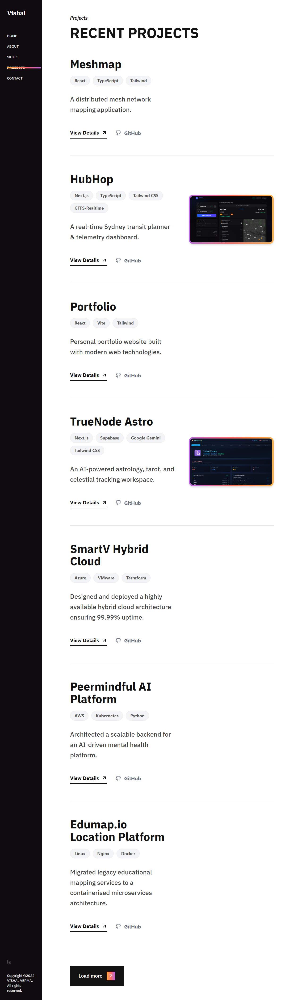
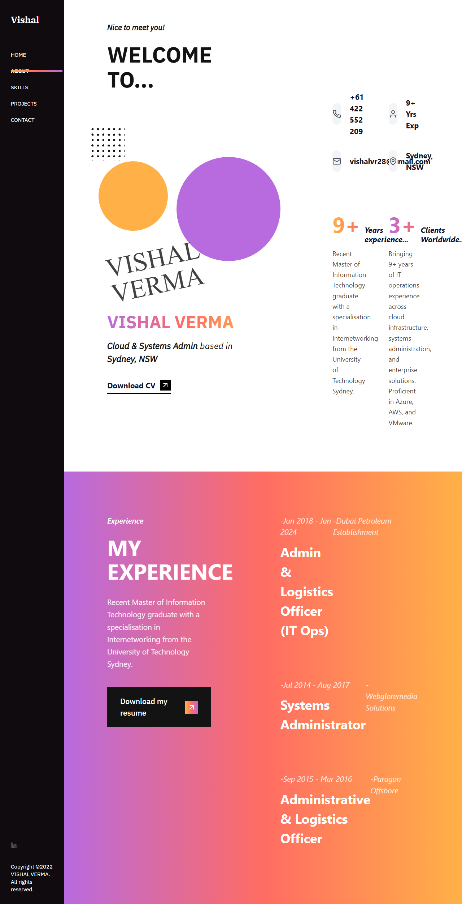
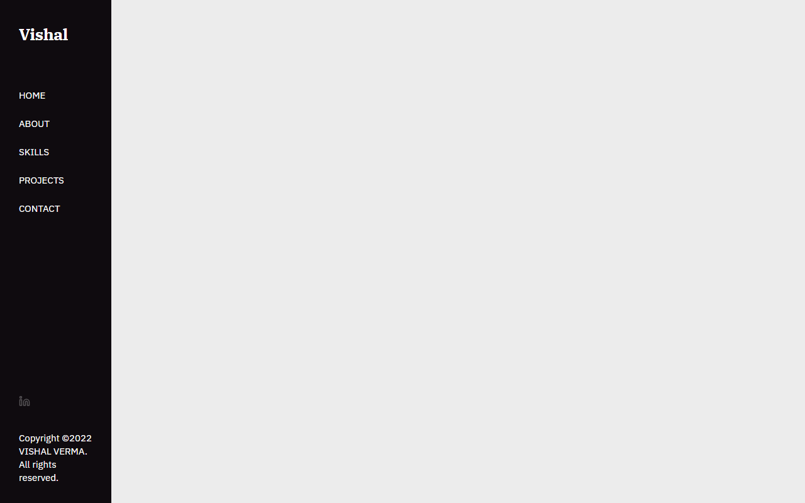
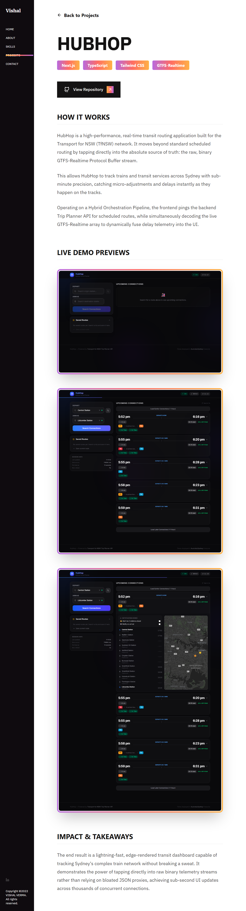
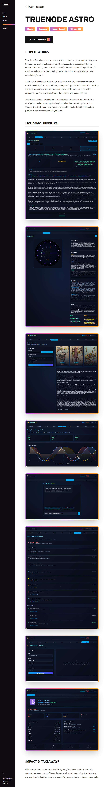
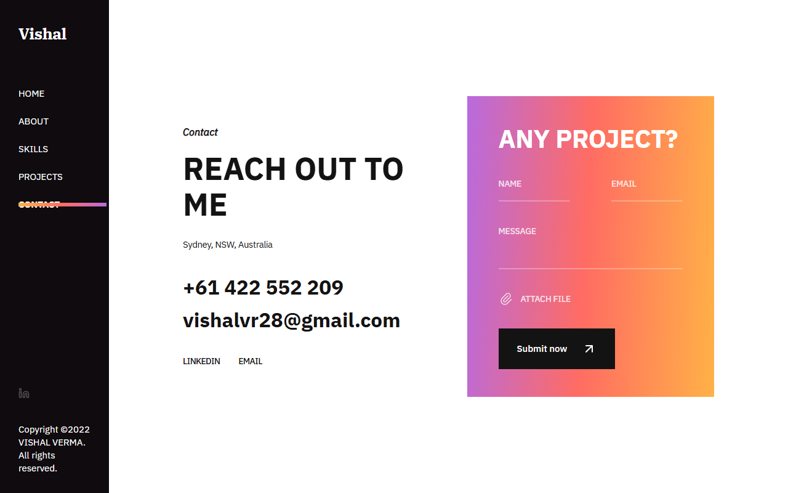

# Fully Automated React Portfolio

Welcome to your personalized, highly-automated portfolio website! This project is built using React, TypeScript, and Tailwind CSS. It features a bold, warm gradient aesthetic, glassmorphism UI elements, and a completely centralized data architecture.

## 📸 Live Demo Gallery

| Home | Projects |
|:---:|:---:|
|  |  |

| About | Services |
|:---:|:---:|
|  |  |

| HubHop Detail | TrueNode Astro Detail |
|:---:|:---:|
|  |  |

| Contact |
|:---:|
|  |
## 🚀 How Changes Work (Content Automation)

You **never** need to touch the `.tsx` React code to update your portfolio! 

All content (text, images, links, projects, and blogs) is completely abstracted into a single configuration file located at:
`src/data/portfolioData.json`

### Making Updates
Whenever you need to update your site, simply open `portfolioData.json` and change the text inside the quotes. 

- **Profile**: Change your name, bio, titles, phone, email, location, and resume link.
- **Socials**: Update your social media links. (Supported icons include `Facebook`, `Twitter`, `Instagram`, `Linkedin`, and `Dribbble`).
- **Services**: Add or modify your specialties. The UI automatically maps over this list to generate the accordion interface.
- **Projects & Blogs**: Add a new block to the JSON arrays. The UI will instantly create a new card in the grid layout!

## 💻 Local Development

To run the project locally on your machine:

1. Install dependencies:
   ```bash
   npm install
   ```
2. Start the development server:
   ```bash
   npm run dev
   ```
3. Open `http://localhost:5173/` in your browser. Any changes you make to `portfolioData.json` will instantly hot-reload on the screen!

## 🌍 How to Make it Live (CI/CD Deployment)

Since your code is pushed to a GitHub repository, deploying it live is incredibly easy and entirely free. We highly recommend using **Vercel** or **Netlify** for continuous deployment. 

Whenever you commit a change to GitHub (like updating your JSON file), the live website will automatically update within seconds!

### Option 1: Deploying with Vercel (Recommended)
1. Go to [Vercel.com](https://vercel.com/) and sign in with your GitHub account.
2. Click **Add New** > **Project**.
3. Locate your `Portfolio` repository and click **Import**.
4. The framework preset will auto-detect as `Vite`.
5. Leave all settings as default and click **Deploy**.
6. Once finished, Vercel will give you a live `.vercel.app` URL (which you can change to a custom `.com` domain later).

### Option 2: Deploying with Netlify
1. Go to [Netlify.com](https://www.netlify.com/) and log in with GitHub.
2. Click **Add new site** > **Import an existing project**.
3. Select **GitHub** and authorize access.
4. Pick your `Portfolio` repository.
5. Build command should be `npm run build` and publish directory should be `dist`.
6. Click **Deploy site**.

### Option 3: Making Changes via GitHub Web
Once the site is deployed, you don't even need to use code editors on your computer to update your portfolio!
1. Go to your repository on GitHub.com.
2. Navigate to `src/data/portfolioData.json`.
3. Click the **Pencil icon** to edit the file right in your browser.
4. Make your text changes, scroll to the bottom, and click **Commit changes**.
5. Your deployment provider (Vercel/Netlify) will automatically detect the commit, rebuild the project, and push the updates to the live web!
